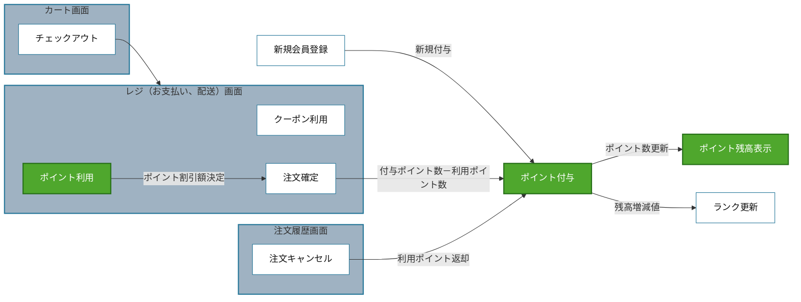

# 対象理解モデル

機能一覧を作る前に使用する。図の見た目ではなく、対象機能の境界、処理契機、値・状態の流れを再現する。

## Mermaidテンプレート

## 作成規則

- テスト対象候補を緑、画面をグレー、関連機能・処理・外部主体を白にして区別する。
- エッジの向きは処理、値、状態、結果の流れる向きにする。
- エッジへ契機または受け渡す具体物を書く。
- 更新するデータが同じでも契機と責務が異なる処理を無条件に統合しない。
- 図に現れない振る舞い断片を残さない。図へ載せない場合は理由を記録する。
- Mermaidが表示できない環境でもコードを成果物として残す。

## 照合

1. 緑の各ノードに機能一覧の項目があるか。
2. 機能一覧の各項目が図のノードへ戻れるか。
3. 各矢印に根拠となる振る舞い断片があるか。
4. 各断片が少なくとも一つの機能候補へ割り当てられているか。
5. 未割当・重複を解消した後、機能の統合・分割・名称を見直したか。
6. Mermaid図、振る舞い断片と機能候補の紐付け、未割当・重複・要確認をユーザーへ提示し、対象理解モデルの承認を得たか。
7. 承認前に機能一覧の確定、品質リスク分析、TADへ進んでいないか。
