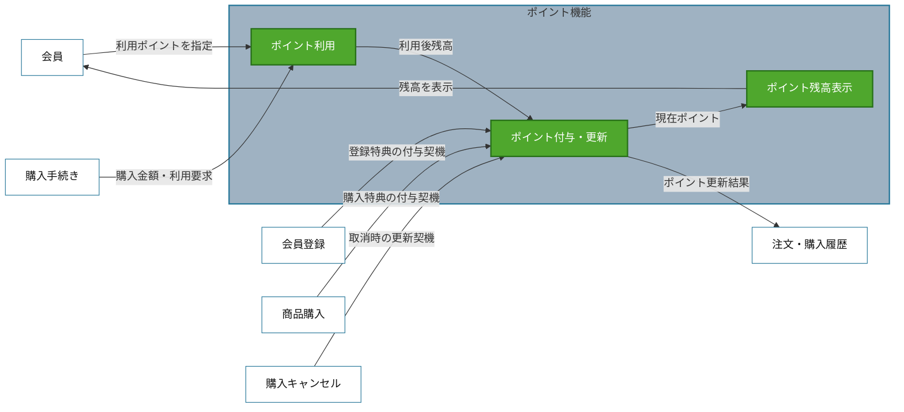
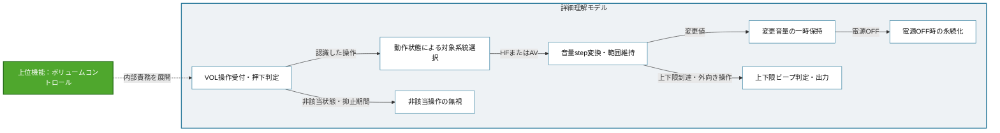

# 全体理解と二層の対象理解モデル

機能一覧を作る前に使用する。最初にテストベース全体の振る舞いを抽出して全体機能候補ランドスケープを作り、そこから今回の設計対象を選ぶ。その後、人が対象を承認する上位対象理解モデルと、AIが網羅性を担保する詳細理解モデルを分ける。図の情報量ではなく、モデルごとの役割を守る。

## 順序を守る

```text
テストベース全体
  ↓ 全章から振る舞い断片を抽出
全振る舞い断片
  ↓ 主体・画面・業務概念・データ・状態・契機を関係付ける
全体機能候補ランドスケープ
  ↓ 全体内の位置付けと関連を根拠に選ぶ
設計対象候補
  ↓ 人が機能境界を承認する
上位対象理解モデル
  ↓ 必要部分だけ内部責務を展開する
詳細理解モデル
```

特定テーマの依頼は、下流の設計対象を指定する。上流の全体理解範囲を同じテーマへ狭めない。例えば「ポイント機能をテストする」という依頼でも、ポイント章だけを読んで機能候補を作らず、会員登録、注文・決済、クーポン、注文キャンセルなどを含むテストベース全体の断片と関係からポイント領域を選ぶ。

## 全体機能候補ランドスケープ

- テストベース全体から抽出した業務上の能力と主要な関係を、高い粒度で表す。
- 正式な機能一覧ではない。設計対象を選ぶ前の暫定モデルである。
- 全振る舞い断片を、設計対象候補、関連機能候補、または理由付き対象外へ割り当てる。
- 人へは全断片を表示せず、全体ランドスケープと対象選定理由を提示する。
- 上位対象理解モデルと一枚で読みやすい場合は、選択した候補を緑、関連候補を白、画面・領域をグレーにして統合してよい。

## 上位対象理解モデル（人間承認用）

外部から見た業務上の能力、関連機能、主要な契機、値・状態・結果の流れを表す。緑ノードは承認後の機能一覧と原則1対1にする。

### Mermaid例：ポイント機能



この図では、利用可能ポイントの上限計算、購入額からの減算、残高保存、警告表示などを独立した緑ノードにしない。それらはポイント利用またはポイント付与・更新の内部責務であり、詳細理解モデルと論理的機能構造で展開する。

### 作成規則

- この図を作る前に、テストベース全体の振る舞い断片と全体機能候補ランドスケープを作る。
- テスト対象候補を緑、画面または対象領域をグレー、関連機能・外部主体を白にする。
- 緑ノードは「システムが外部に対してできること」として命名する。
- 同じ業務概念、利用者・関連機能から見た同じ上位主責務、同じデータ・状態のライフサイクルを持つ断片を機能候補へまとめる。
- 上位主責務とは、ブラックボックスとして外部から観測できる業務上の能力と期待される結果である。
- 入力調整、計算、判定、保存、表示、警告、整合性維持は内部責務であり、それだけを理由に緑ノードを分けない。
- 上位主責務、外部から見た目的、期待される業務結果が独立する場合に機能を分ける。
- 同じ外部目的の内部にある入力調整、計算、判定、保存、表示、警告は、独立した契約がなければ緑ノードへ昇格させない。
- エッジには主要な契機、受け渡す値、更新状態、結果の利用関係を書く。「連携」のような抽象語だけにしない。
- 全境界値、全計算式、全例外経路を載せない。レビュー判断に必要な関係だけを残す。
- Mermaidが表示できない環境でもコードを成果物として残す。

### 承認時の提示

図とともに、次の要約を提示する。

`機能候補 | 外部から見た目的 | 主な契機 | 扱う状態・データ | 関連機能 | 根拠断片ID`

承認論点は機能境界、高リスク、仕様未定義に絞り、原則10項目以内にする。全振る舞い断片や詳細経路は既定表示しない。

## 詳細理解モデル（AI内部・非承認）

上位モデルだけで振る舞い断片、値、状態、例外を照合できない場合に作る。論理的機能構造へつなぐため、入力調整、変換、貯蔵、出力調整、サポート、相互作用を展開してよい。

### Mermaid例：ボリュームコントロールの内部展開



詳細ノードは機能一覧の候補ではない。上位機能への所属と根拠断片IDを持たせ、テストカテゴリ、欠陥仮説、詳細確認点を導出するために使う。人へは質問、境界争い、高リスク、仕様未定義、トレース確認がある場合だけ必要部分を展開する。

## 二層の照合

1. テストベース全体から振る舞い断片を抽出したか。
2. 全断片が設計対象候補、関連機能候補、または理由付き対象外へ割り当てられているか。
3. 全体ランドスケープから設計対象を選んだ理由を説明できるか。
4. 上位モデルの緑ノードと機能一覧が原則1対1か。
5. 各緑ノードを外部目的または業務上の成果で説明できるか。
6. 内部計算や保存処理が、テスト可能という理由だけで緑ノードになっていないか。
7. 詳細モデルを作った場合、各詳細ノードが一つ以上の上位機能と根拠断片へ戻れるか。
8. 未割当と理由のない重複を内部で解消したか。
9. 人へ提示する情報が全体ランドスケープ、対象選定理由、上位図、機能候補要約、重要な承認論点に絞られているか。
10. 上位モデルの承認前に機能一覧の確定、品質リスク分析、TADへ進んでいないか。
